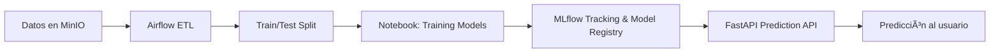

# AP_2025_B3_TP2_Mendoza_Dante

## Arquitectura general del sistema

## Ciclo de vida del modelo

## Pipeline dentro de Airflow (DAG)

# AP_2025_B3_TP2_Mendoza_Dante

## 📌 Arquitectura general del sistema

## 📌 Ciclo de vida del modelo

```mermaid
flowchart LR
    A["Datos en MinIO"] --> B["Airflow ETL"]
    B --> C["Train/Test Split"]
    C --> D["Notebook: Training Models"]
    D --> E["MLflow Tracking & Model Registry"]
    E --> F["FastAPI Prediction API"]
    F --> G["Predicción al usuario"]

    %% Estilos
    style A fill:#9467bd,stroke:#000,stroke-width:2px,color:#fff
    style B fill:#1f77b4,stroke:#000,stroke-width:2px,color:#fff
    style C fill:#8c564b,stroke:#000,stroke-width:2px,color:#fff
    style D fill:#bcbd22,stroke:#000,stroke-width:2px,color:#fff
    style E fill:#2ca02c,stroke:#000,stroke-width:2px,color:#fff
    style F fill:#ff7f0e,stroke:#000,stroke-width:2px,color:#fff
    style G fill:#d62728,stroke:#000,stroke-width:2px,color:#fff
```

## 📌 Pipeline dentro de Airflow (DAG)

