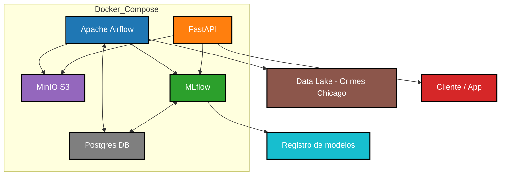
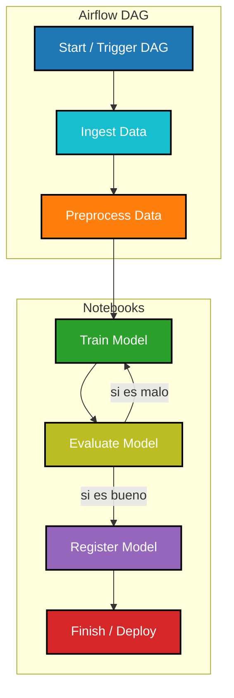

# AP_2025_B3_TP2_Mendoza_Dante

## 📌 Arquitectura general del sistema

```mermaid
flowchart TB
    subgraph Docker_Compose
        A[Apache Airflow]
        B["MinIO S3"]
        C[MLflow]
        D[FastAPI]
        H[Postgres DB]
    end

    %% Relaciones principales
    A --> E["Data Lake - Crimes Chicago"]
    A --> B
    A --> C
    A <--> H
    C <--> H
    D --> C
    D --> B
    C --> F["Registro de modelos"]
    D --> G["Cliente / App"]

    %% Estilos
    style A fill:#1f77b4,stroke:#000,stroke-width:2px,color:#fff
    style B fill:#9467bd,stroke:#000,stroke-width:2px,color:#fff
    style C fill:#2ca02c,stroke:#000,stroke-width:2px,color:#fff
    style D fill:#ff7f0e,stroke:#000,stroke-width:2px,color:#fff
    style E fill:#8c564b,stroke:#000,stroke-width:2px,color:#fff
    style F fill:#17becf,stroke:#000,stroke-width:2px,color:#fff
    style G fill:#d62728,stroke:#000,stroke-width:2px,color:#fff
    style H fill:#7f7f7f,stroke:#000,stroke-width:2px,color:#fff
```

## 📌 Ciclo de vida del modelo

```mermaid
flowchart LR
    A["Data Lake - Crimes Chicago"] --> B["Airflow ETL"]
    B <--> C["MinIO (Almacenamiento)"]
    C --> D["Train/Test Split"]
    D --> E["Entrenamiento (Notebook/Script)"]
    E --> F["MLflow Tracking"]
    F --> G["MLflow Registro de Modelos"]
    G --> H["FastAPI Predicción"]
    H --> I["Predicción al usuario"]

    %% Integración con Postgres
    F <---> J["Postgres (Metadatos MLflow)"]

    %% Estilos
    style A fill:#8c564b,stroke:#000,stroke-width:2px,color:#fff
    style B fill:#1f77b4,stroke:#000,stroke-width:2px,color:#fff
    style C fill:#9467bd,stroke:#000,stroke-width:2px,color:#fff
    style D fill:#2ca02c,stroke:#000,stroke-width:2px,color:#fff
    style E fill:#bcbd22,stroke:#000,stroke-width:2px,color:#fff
    style F fill:#2ca02c,stroke:#000,stroke-width:2px,color:#fff
    style G fill:#17becf,stroke:#000,stroke-width:2px,color:#fff
    style H fill:#ff7f0e,stroke:#000,stroke-width:2px,color:#fff
    style I fill:#d62728,stroke:#000,stroke-width:2px,color:#fff
    style J fill:#7f7f7f,stroke:#000,stroke-width:2px,color:#fff
```

## 📌 Pipeline dentro de Airflow (DAG)

```mermaid
flowchart TD
    %% --- DAG de Airflow ---
    subgraph Airflow_DAG["Airflow DAG"]
        Start["Start / Trigger DAG"] --> Ingest["Ingest Data"]
        Ingest --> Preprocess["Preprocess Data"]
    end

    %% --- Proceso en Notebooks ---
    subgraph Notebooks["Notebooks"]
        Preprocess --> Train["Train Model"]
        Train --> Evaluate["Evaluate Model"]

        Evaluate --> |si es bueno| Register_Model["Register Model"]
        Evaluate --> |si es malo| Train

        Register_Model --> End["Finish / Deploy"]
    end

    %% Estilos
    style Start fill:#1f77b4,stroke:#000,stroke-width:2px,color:#fff
    style Ingest fill:#17becf,stroke:#000,stroke-width:2px,color:#fff
    style Preprocess fill:#ff7f0e,stroke:#000,stroke-width:2px,color:#fff
    style Train fill:#2ca02c,stroke:#000,stroke-width:2px,color:#fff
    style Evaluate fill:#bcbd22,stroke:#000,stroke-width:2px,color:#fff
    style Register_Model fill:#9467bd,stroke:#000,stroke-width:2px,color:#fff
    style End fill:#d62728,stroke:#000,stroke-width:2px,color:#fff
```
