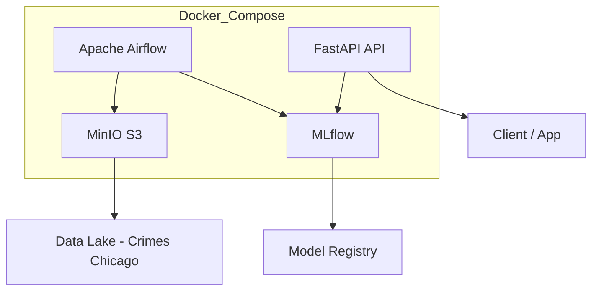
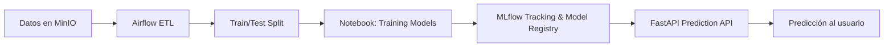
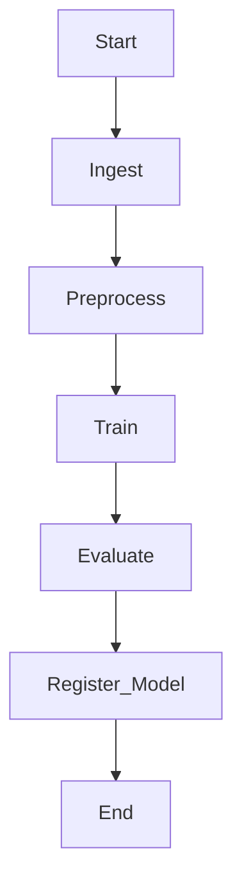

# AP_2025_B3_TP2_Mendoza_Dante

## Arquitectura general del sistema

```mermaid
flowchart TB
    subgraph Docker_Compose
        A[Apache Airflow]
        B["MinIO S3"]
        C[MLflow]
        D[FastAPI API]
    end

    A --> B
    A --> C
    D --> C
    B --> E["Data Lake - Crimes Chicago"]
    C --> F["Model Registry"]
    D --> G["Client / App"]
```

## Ciclo de vida del modelo

```mermaid
flowchart LR
    A[Datos en MinIO] --> B[Airflow ETL]
    B --> C[Train/Test Split]
    C --> D[Notebook: Training Models]
    D --> E[MLflow Tracking & Model Registry]
    E --> F[FastAPI Prediction API]
    F --> G[Predicción al usuario]
```

## Pipeline dentro de Airflow (DAG)

```mermaid
flowchart TD
    Start --> Ingest
    Ingest --> Preprocess
    Preprocess --> Train
    Train --> Evaluate
    Evaluate --> Register_Model
    Register_Model --> End
```

